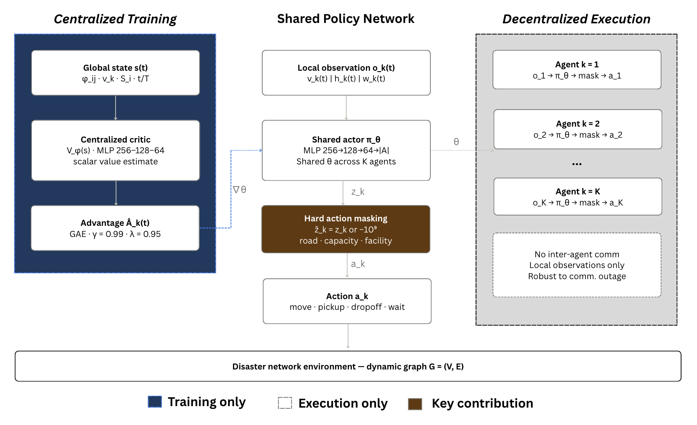

<p align="center">
  
</p>

<h1 align="center">MAPPO-DisasterWaste</h1>

<h3 align="center">Multi-Agent Reinforcement Learning for Post-Disaster Waste Management on Dynamic Road Networks</h3>

<p align="center">
  
  
  
  
  
  
</p>

<p align="center">
  <strong>CTDE · Hard Action Masking · Poisson Road Damage · Multi-Objective Reward · Carbon Tax</strong>
</p>

<p align="center">
  Muhammed Şara &nbsp;·&nbsp; Süleyman Eken &nbsp;·&nbsp; Erfan Babaee Tirkolaee
</p>

<p align="center">
  <a href="#introduction">Introduction</a> •
  <a href="#main-results-table-5--s2-medium">Key Results</a> •
  <a href="#methodology-overview">Methodology</a> •
  <a href="#repository-structure">Structure</a> •
  <a href="#getting-started">Quick Start</a> •
  <a href="#citation">Citation</a>
</p>

---

###  Introduction

This repository contains the source code, trained models, and benchmark data accompanying the research paper. We propose a **Multi-Agent Proximal Policy Optimization (MAPPO)** framework for coordinating heterogeneous vehicle fleets to collect and transport earthquake-generated waste across dynamically degrading road networks.

**Key Contributions:**
- **CTDE Architecture** — Centralized Training with Decentralized Execution ensures resilient operation even when communication infrastructure collapses
- **Hard Action Masking** — A $-10^9$ sentinel penalty guarantees zero constraint violations (road passability, vehicle capacity, facility limits)
- **Dynamic Environment** — Poisson road damage + Log-Normal waste generation model post-disaster conditions
- **Multi-Objective Reward** — Simultaneously minimizes cost, time, and CO₂ emissions while maximizing recycling throughput
- **Carbon Tax Formulation** — Economic emission penalty ($50/tonne CO₂) with load-dependent fuel model

---

###  Main Results (Table 5 — S2-Medium)

| Algorithm | Total Cost | CO₂ (kg) | Service Level | Reward |
|-----------|-----------|----------|---------------|--------|
| **MAPPO (CTDE)** | **7,590** | **4,489** | **1.21%** | **−351.8** |
| Nearest Neighbour | 24,594 | 14,577 | 0.66% | −413.3 |
| Genetic Algorithm | 24,069 ± 3,999 | 15,024 ± 2,961 | 0.28% | −420.4 |
| Clarke–Wright | 72,353 | 43,618 | 0.48% | −478.8 |
| Single-Agent PPO | 70,782 ± 909 | 40,052 ± 639 | N/A | −451.5 |
| MILP (static LB) | 24 | 8 | 0.02% | −397.0 |

> MAPPO achieves **68.5% cost reduction** and **70.1% emission reduction** vs. the best heuristic.

--

###  Repository Structure

```
MAPPO-DisasterWaste/
├── README.md                          # This file
├── LICENSE                            # MIT License
├── requirements.txt                   # Python dependencies
├── .gitignore                         # Git ignore rules
├── plot_ablation.py                   # Ablation figure generator (Figure 5)
│
├── src/                               # Source code
│   ├── __init__.py
│   ├── envs/                          # Disaster waste environment
│   │   ├── disaster_waste_env.py      #   Main Gym/PettingZoo environment
│   │   ├── vehicle.py                 #   Vehicle dynamics & emission model
│   │   ├── network.py                 #   Road network & Poisson damage
│   │   ├── waste_model.py             #   Log-Normal waste generation
│   │   └── scenario_generator.py      #   Solomon adapter & scenario builder
│   ├── agents/                        # MAPPO implementation
│   │   ├── mappo.py                   #   MAPPO trainer (CTDE)
│   │   ├── actor_network.py           #   Shared actor with action masking
│   │   ├── critic_network.py          #   Centralised critic V_φ(s)
│   │   └── buffer.py                  #   Rollout buffer & GAE
│   ├── baselines/                     # Benchmark algorithms
│   │   ├── nearest_neighbor.py        #   Greedy nearest-node heuristic
│   │   ├── clarke_wright.py           #   Savings-based route merging
│   │   ├── genetic_algorithm.py       #   GA with OX crossover
│   │   ├── milp_solver.py             #   OR-Tools MILP (static lower bound)
│   │   └── single_ppo.py             #   Single-agent PPO ablation
│   ├── experiments/                   # Training & evaluation scripts
│   │   ├── train.py                   #   MAPPO training entry point
│   │   └── benchmark.py              #   Multi-algorithm benchmarking
│   └── utils/                         # Helpers
│       └── solomon_adapter.py         #   Solomon VRPTW → disaster network
│
├── configs/                           # Scenario configurations (S1–S4)
│   ├── S1_SMALL.yaml                  #   15 nodes, 4 vehicles, T=100
│   ├── S2_MEDIUM.yaml                 #   27 nodes, 10 vehicles, T=200
│   ├── S3_LARGE.yaml                  #   65 nodes, 20 vehicles, T=300
│   └── S4_SEVERE.yaml                 #   33 nodes, 10 vehicles, λ=0.12
│
├── data/                              # Benchmark results (CSV)
│   ├── benchmark_results_S1_SMALL.csv
│   ├── benchmark_results_S2_MEDIUM.csv
│   ├── benchmark_results_S3_LARGE.csv
│   └── benchmark_results_S4_SEVERE.csv
│
├── models/                            # Pre-trained checkpoints 
│   ├── mappo_s2_medium_best.pt
│   └── mappo_s2_medium_final.pt
│
└── figures/                            # Publication figures (PDF + PNG)
    ├── fig_system_architecture.png     #   System architecture diagram
    ├── fig1_cost_S{1..4}.pdf.          #   Cost comparison per scenario
    ├── fig2_emission_S{1..4}.pdf.      #   Emission comparison per scenario
    ├── fig_training_convergence.png    #   Service level per scenario
    └── fig_ablation_cost.pdf           #   MAPPO vs SinglePPO ablation
```

---

###  Getting Started

#### Prerequisites
- Python ≥ 3.8
- PyTorch ≥ 1.12
- CUDA (optional, for GPU acceleration)

#### Installation
```bash
git clone https://github.com/muhammedsara/MAPPO-DisasterWaste.git
cd MAPPO-DisasterWaste
pip install -r requirements.txt
```

#### Training
```bash
# Train MAPPO on S2-Medium scenario (default)
python src/experiments/train.py --scenario S2_MEDIUM --total-steps 500000

# Train on S1-Small (quick test, ~3 minutes)
python src/experiments/train.py --scenario S1_SMALL --total-steps 200000
```

#### Evaluation & Benchmarking
```bash
# Run all baselines on all scenarios (reproduces Table 5)
python src/experiments/benchmark.py --scenarios S1_SMALL S2_MEDIUM S3_LARGE S4_SEVERE

# Evaluate a specific checkpoint
python src/experiments/benchmark.py --checkpoint results/models/mappo_s2_medium.pt --scenario S2_MEDIUM
```

#### Regenerate Figures
```bash
# Ablation study figure (Figure 5)
python plot_ablation.py

# All benchmark plots (Figures 3–4)
python src/experiments/benchmark.py --plot-only
```

---

###  Methodology Overview

```
┌──────────────────────┐   ┌─────────────────────┐   ┌──────────────────────┐
│  Centralized Training│   │ Shared Policy Network│   │ Decentralized Exec.  │
│  (Training only)     │   │                      │   │ (Execution only)     │
│                      │   │  Local obs o_k(t)    │   │                      │
│  Global state s(t) ──┼──▶│  ──▶ Actor π_θ ──▶  │──▶│  Agent k=1..K        │
│  Critic V_φ(s)       │   │  Hard Action Masking │   │  o_k → π_θ → mask    │
│  GAE: γ=0.99 λ=0.95 │   │  z̃_k = z_k or -10⁹ │   │  → a_k               │
└──────────────────────┘   └─────────────────────┘   └──────────────────────┘
                           Disaster Network: G = (V, E)
```

**Four-Objective Reward Function** (Eq. 14):
```
r_k(t) = -ω_c·cost/c̄ - ω_τ·time/τ̄ - ω_e·emis_tax/ē + ω_r·recy/c̄
```
where `ω = (0.25, 0.25, 0.25, 0.25)` and emissions use the Carbon Tax formulation.

---


**Baseline Fairness:** All heuristic and metaheuristic baselines (NN, Clarke–Wright, GA) use the *identical* four-objective scalarised reward function (Eq. 14) as their fitness/evaluation metric. Time, emission, and recycling are **not** ignored — all four objectives contribute equally. The MILP solver operates on a static network snapshot at *t*=0 and serves only as a theoretical lower bound; its "Reward" is computed by retroactively evaluating its static routes through the stochastic simulator.

---

###  Evaluation Metrics

| Metric | Definition |
|--------|------------|
| **Total Cost** | Cumulative operational transport cost over the episode ($/episode) |
| **CO₂ Emissions** | Fleet-wide carbon emissions using load-dependent model (kg CO₂) |
| **Service Level** | `SL = (Total Collected Waste / Total Generated Waste) × 100%` |
| **Reward** | Normalised four-objective scalarised reward (Eq. 14) |

> **Why is Service Level ≈1%?** Post-earthquake debris volumes are enormous (e.g., 210M tonnes from the 2023 Kahramanmaraş earthquakes). With finite fleet capacity, even optimal policies can only collect a small fraction of *total generated* waste. The meaningful comparison is *relative*: MAPPO collects **1.84×** more waste than the best heuristic under identical constraints.

---

###  Training & Hyperparameter Calibration

| Parameter | Value | Source |
|-----------|-------|--------|
| Discount γ | 0.99 | Schulman et al. (PPO, 2017) |
| GAE λ | 0.95 | Schulman et al. (2016) |
| Clip ratio ε | 0.2 | PPO default |
| Actor LR | 3×10⁻⁴ | **Grid Search on S1-Small** |
| Rollout length | 128 | **Grid Search on S1-Small** |
| Mini-batch size | 64 | **Grid Search on S1-Small** |
| Training steps | 500K | S2-Medium (~20 min on GPU) |

Hyperparameters were selected via a **two-stage process**: (1) PPO literature defaults from [Schulman et al., 2017] validated for multi-agent settings by [Yu et al., 2022], then (2) a coarse grid search over learning rate, rollout length, and mini-batch size on S1-Small (completes in <3 min). The best combination was used for all S2-Medium training without further tuning.

---

###  Acknowledgements

This work was conducted at the Department of Information System Engineering, **Kocaeli University**, with co-authors affiliated with **Istinye University** (Istanbul) and **Yuan Ze University** (Taoyuan, Taiwan). 

Disaster scenario benchmarking builds on the [Solomon VRPTW benchmark suite](https://www.sintef.no/projectweb/top/vrptw/solomon-benchmark/) and is informed by the [UNDP Türkiye Earthquakes Recovery and Reconstruction Assessment (2023)](https://www.undp.org/turkiye/news/two-years-look-undps-earthquake-recovery-efforts-turkiye). 

We thank the open-source communities behind:
* [PettingZoo](https://pettingzoo.farama.org/)
* [PyTorch](https://pytorch.org/)
* [NetworkX](https://networkx.org/)
* [Google OR-Tools](https://developers.google.com/optimization)

---

###  Contact

For questions or suggestions, please open an issue or contact muhammedsaraa@gmail.com.

---

###  License

This project is licensed under the MIT License — see the [LICENSE](LICENSE) file for details.
