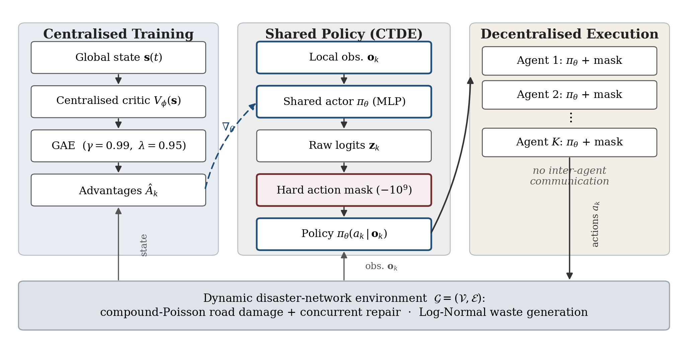

<h1 align="center">MAPPO for Post-Disaster Waste Management on Dynamic Road Networks</h1>

<p align="center">
  
  
  
  
  
</p>

<p align="center">
  
</p>

Multi-Agent Proximal Policy Optimization (**MAPPO**) under the **Centralised
Training, Decentralised Execution (CTDE)** paradigm, with **hard action masking**,
for coordinating a heterogeneous fleet of waste-collection vehicles on a
**dynamically degrading** road network after an earthquake. The environment couples
a compound-Poisson road-damage process (with concurrent repair) and a Log-Normal
waste-generation process, and the policy optimises a four-objective reward (cost,
travel time, carbon emission, recycling throughput).

> **Status — accepted-revision code (Round 3).** This repository is kept in sync
> with the latest revision of the manuscript *"…: A MAPPO Approach with **Hard**
> Action Masking"* (Applied Soft Computing, ASOC-D-26-06444). The code is the single
> source of truth: the paper's methods, pseudocode and scenario description were
> aligned to exactly what runs here. See [What's new](#whats-new-in-this-revision).

---

## Overview

Post-disaster debris clearance is a stochastic, dynamic, multi-objective vehicle
routing problem: roads fail and recover through aftershocks, debris is generated
continuously and unevenly, and a heterogeneous fleet must trade off cost, time,
emissions and recycling. This project models it as a Dec-POMDP and solves it with a
shared-actor MAPPO policy whose feasibility is enforced by a hard action mask, so
that impassable-road, empty-pickup and capacity/facility violations are never
selected.

## Key results

Mean over **30 independent random seeds** (95 % confidence intervals in the paper);
best value among the **online methods** in bold. Single-agent PPO is an **ablation**
of the CTDE design (not a competing baseline); the static MILP result is a
**full-information reference**, not an online method.

| Metric (S2-Medium) | MAPPO | GA | NN | CWSA | Single-PPO *(ablation)* |
|---|---|---|---|---|---|
| Total cost | **7,652** | 14,173 | 24,594 | 72,353 | 10,024 |
| CO₂ (kg) | **8,759** | 17,783 | 32,410 | 96,207 | 13,324 |
| Service level (%) | **1.04** | 0.24 | 0.65 | 0.48 | 0.32 |
| Reward | **−374.6** | −403.9 | −406.3 | −450.9 | −401.4 |

- **Best multi-objective reward in all four scenarios** (S1–S4), all *p* < 0.001
  (paired Wilcoxon; effect sizes 0.60–1.00).
- On S2-Medium: **−46 % cost** and **−51 % CO₂** vs. the best baseline (GA);
  **−69 % / −73 %** vs. Nearest Neighbour; highest service level.
- On the smallest (S1) and most severe (S4) tiers the GA achieves lower *raw* cost,
  so the comparison is a genuine **trade-off** — MAPPO's edge is joint
  multi-objective coordination.
- **Action masking is essential:** removing it yields ~2000 infeasible
  actions/episode and zero service; the hard mask attains zero violations. Under
  10–20 % mask-input noise a paired Wilcoxon test shows only a tiny reward change
  (< 0.8 % of the reward scale), i.e. performance is preserved.
- **CTDE vs. monolithic controller** (single-agent PPO, same budget): single-agent
  PPO incurs **+31.0 % cost** and **+52.1 % CO₂** relative to MAPPO (equivalently,
  MAPPO is 23.7 % / 34.3 % lower), using **6.9× more actor parameters**; the shared
  actor is *O(1)* in fleet size vs. *O(K)*.
- **Controlled sensitivity** over fleet size, horizon, demand intensity and the
  road-passability threshold: the framework scales gracefully and is essentially
  invariant to the masking threshold over its operational range.
- **Zero-shot robustness:** the S2 policy transfers, without retraining, to damage
  intensities up to 4× those seen in training.

## Architecture

A single shared actor $\pi_\theta$ maps each vehicle's local observation to a masked
categorical action distribution; a centralised critic $V_\phi$ sees the global state
during training only. The critic is *mask-agnostic*, so a fluctuating feasible-action
count does not enter the value target — stabilising the advantage estimates that
drive the shared actor. See the diagram above.

## Repository structure

```
.
├── src/                       # Framework
│   ├── environment/           # DisasterWasteEnv (PettingZoo), network, waste model, scenario generator
│   ├── agents/                # MAPPO: shared actor, centralised critic, GAE buffer
│   ├── baselines/             # Nearest-Neighbour, Clarke–Wright, GA, MILP (OR-Tools); single-agent PPO (ablation)
│   ├── experiments/           # Core train.py / benchmark.py entry points
│   └── utils/                 # Optional Solomon-instance adapter (not used for the reported tiers)
├── experiments/               # Study drivers, results and trained models
│   ├── train_mappo.py         # Domain-randomised MAPPO training (weights / capacity / fleet configurable)
│   ├── train_eval_single_ppo.py
│   ├── eval_multiseed.py      # Paired 30-seed benchmark (MAPPO + baselines)
│   ├── eval_masking.py        # Masking ablation (hard / soft / none + corrupted mask)
│   ├── eval_mappo_only.py     # Multi-seed eval of a single MAPPO variant
│   ├── eval_sensitivity.py    # Controlled sensitivity: passability / horizon / demand (fixed S2 policy)
│   ├── run_fleet.sh           # Controlled sensitivity: fleet size K∈{5,15,20} (retrain) + eval
│   ├── eval_zeroshot.py       # Zero-shot generalisation
│   ├── eval_distshift.py      # Zero-shot under higher damage intensity
│   ├── analyze.py             # Aggregate CSVs → stats + significance tests
│   ├── compute_ci_sens.py     # 95 % CIs + controlled-sensitivity summaries
│   ├── make_tables.py         # LaTeX table rows
│   ├── plot_results.py        # Regenerate all data figures
│   ├── plot_controlled_sensitivity.py  # 4-panel controlled-sensitivity figure
│   ├── plot_architecture.py   # Architecture diagram
│   ├── run_main.sh            # Train 4 models + 30-seed benchmark
│   ├── run_ablations.sh       # Ablations + reward-weight + capacity
│   ├── results/               # Result CSVs + analysis summary
│   └── models/S{1..4}_*/      # Trained scenario policies (mappo_best.pt + train_log.json)
├── configs/                   # Scenario configurations (S1–S4)
├── figures/                   # Publication figures (incl. controlled sensitivity)
├── assets/                    # README assets (architecture diagram)
├── requirements.txt · LICENSE · README.md
```

The four scenario policies are shipped so the benchmark can be reproduced directly.
The variant models (reward-weight / capacity / fleet-size / masking) are regenerated
by `run_ablations.sh` and `run_fleet.sh`; their result CSVs are already in
`experiments/results/`.

## Installation

```bash
python -m venv .venv && source .venv/bin/activate
pip install -r requirements.txt
```

Python ≥ 3.10, PyTorch ≥ 2.1. A CUDA GPU is recommended (a full 5×10⁵-step run
takes a few minutes on an RTX 5000-class GPU). `ortools` is only needed for the
static MILP reference.

## Quick start

Evaluate a shipped model over 30 seeds:

```bash
python experiments/eval_multiseed.py --scenario S2_MEDIUM \
       --model experiments/models/S2_MEDIUM/mappo_best.pt --n-seeds 30 --skip-milp
```

Train a policy from scratch:

```bash
python experiments/train_mappo.py --scenario S2_MEDIUM --timesteps 500000 \
       --out-dir experiments/models/S2_MEDIUM
```

## Reproducing the paper

```bash
bash experiments/run_main.sh        # train S1–S4 + paired 30-seed benchmark
bash experiments/run_ablations.sh   # single-PPO, masking, reward-weight, capacity
bash experiments/run_fleet.sh       # fleet-size sensitivity (K = 5, 15, 20)
python experiments/eval_sensitivity.py                   # passability / horizon / demand sweeps
python experiments/eval_distshift.py                     # zero-shot distribution shift
python experiments/analyze.py                            # stats + significance tests
python experiments/compute_ci_sens.py                    # 95 % CIs + sensitivity summaries
python experiments/make_tables.py                        # LaTeX table rows
python experiments/plot_results.py                       # all data figures
python experiments/plot_controlled_sensitivity.py        # controlled-sensitivity figure
```

## Configuration

Four disaster tiers (`configs/`) of escalating severity:

| Tier | Nodes | Vehicles | Damage λ | Horizon | Purpose |
|---|---|---|---|---|---|
| S1-Small | 15 | 4 | 0.03 | 100 | validation |
| S2-Medium | 27 | 10 | 0.05 | 200 | main experiments |
| S3-Large | 65 | 20 | 0.07 | 300 | scalability |
| S4-Severe | 33 | 10 | 0.12 | 250 | resilience |

Each tier is produced by a deterministic, seeded **parametric scenario generator**
(`src/environment/scenario_generator.py` → `generate_random_network`): it places the
configured number of waste-generation sites, TCPs, sorting facilities, landfills and
depots uniformly at random in an *L×L* area, connects them with a distance-thresholded
road graph, and attaches the Log-Normal waste and compound-Poisson damage processes —
so every instance is reproducible from its seed. This random-uniform construction is
structurally comparable to Solomon's random (*R*-class) VRPTW instances; an **optional**
adapter (`src/utils/solomon_adapter.py`) can import classical Solomon instances into
the same format, but it is **not** used for the reported tiers.

## What's new in this revision

This snapshot corresponds to the Round-3 (minor) revision. The **code is unchanged**
in substance; the revision reconciled the *paper* with this code and added reporting:

- **Scenario description corrected** to the parametric generator actually used (the
  Solomon adapter is optional and unused for S1–S4).
- **Baseline pseudocode aligned with the code** — notably the GA optimises a fast
  *surrogate* objective (health-penalised route distance + coverage penalty) and only
  its best solution is scored through the environment.
- **Confidence intervals** reported throughout; the mask-robustness claim is now a
  paired Wilcoxon test.
- **Consistent single-agent-PPO percentages** (one stated denominator) and a corrected,
  non-monotonic fleet-size discussion.
- **Controlled sensitivity** scripts/data added (`eval_sensitivity.py`, `run_fleet.sh`,
  `compute_ci_sens.py`, `plot_controlled_sensitivity.py`).

## Citation

```bibtex
@article{sara2026mappo,
  title   = {Multi-Agent Reinforcement Learning for Post-Disaster Waste Management
             on Dynamic Road Networks: A MAPPO Approach with Hard Action Masking},
  author  = {{\c{S}}ara, Muhammed and Eken, S{\"u}leyman and Babaee Tirkolaee, Erfan},
  journal = {Applied Soft Computing (under review)},
  year    = {2026}
}
```

## License

MIT — see [LICENSE](LICENSE).

## Contact

Süleyman Eken — `suleyman.eken@kocaeli.edu.tr` · Kocaeli University, Department of
Information Systems Engineering.
